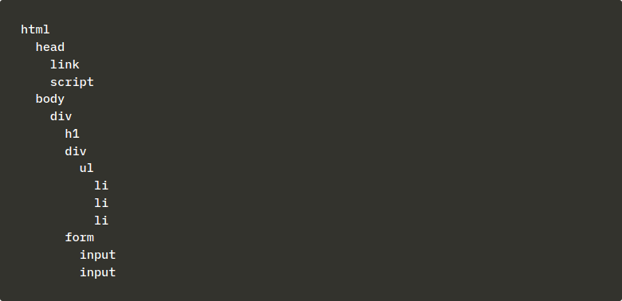

# Document Object Model (დოკუმენტის ობიექტური მოდელი) - DOM

Html გვერდი შეგვიძლია წარმოვიდგინოთ როგორც ხისებრი სტრუქტურა.

ეს ხისებრი სტრუქტურა შეგვიძლია ვნახოთ ბრაუზერის კონსოლის Elements ტაბში.

ბრაუზერის მუშაობა HTML ელემენტების ხის სახით წარმოდგენაზეა დაფუძნებული.

Document Object Model (დოკუმენტის ობიექტური მოდელი)  არის [აპლიკაციის პროგრამირების ინტერფეისი](https://ka.wikipedia.org/wiki/%E1%83%90%E1%83%9E%E1%83%9A%E1%83%98%E1%83%99%E1%83%90%E1%83%AA%E1%83%98%E1%83%98%E1%83%A1_%E1%83%9E%E1%83%A0%E1%83%9D%E1%83%92%E1%83%A0%E1%83%90%E1%83%9B%E1%83%98%E1%83%A0%E1%83%94%E1%83%91%E1%83%98%E1%83%A1_%E1%83%98%E1%83%9C%E1%83%A2%E1%83%94%E1%83%A0%E1%83%A4%E1%83%94%E1%83%98%E1%83%A1%E1%83%98) (Application Programming Interface) , API, რომელიც ვებ-გვერდის ხისებრი მოდელის პროგრამულად მოდიფიკაციის საშუალებას გვაძლევს. წინა ქვეთავში გამოვიყენეთ ჯავასკრიპტის კოდი, სადაც DOM-API-ს საშუალებით ვებ-გვერდზე ჩანაწერების სია დავამატეთ.

DOM-API-ს გამოყენებით ვქმნით ახალ ელემენტს და ვინახავთ `ul` ცვლადში, შემდეგ ვამატებთ რამდენიმე შვილობილ ელემენტს:

საბოლოოდ, `ul` ელემენტს ვსვამთ შესაბამის ადგილას მთლიანი ვებ-გვერდის ხეში.

