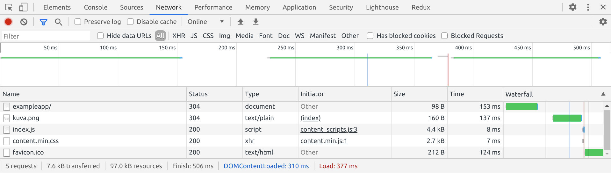
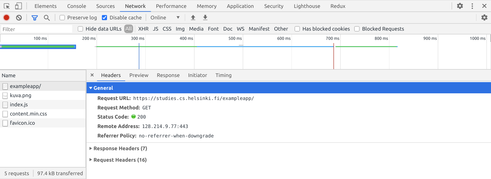

# HTTP GET

სერვერსა და ბროუზერს შორის კომუნიკაცია [HTTP](https://developer.mozilla.org/en-US/docs/Web/HTTP) პროტოკოლის საშუალებით ხდება. Network - ტაბი გვაჩვენებს როგორია კომუნიკაციის პროცესი.

როდესაც გვერდის დარეფრეშებას ეცდებით \(F5 ღილაკზე დაჭერით ან ბროუზერის ↺ სიმბოლოზე დაკლიკებით\), კონსოლი გაჩვენებთ რომ 5 სხვადასხვა მიმართვა გაიგზავნა სერვერზე და შესაბამისად 5 სხვადასხვა რესურსი ჩაიტვირთა თქვენს ბროუზერში: 

* პირველად ჩაიტვირთა თავად გვერდის კონტენტი _/exampleapp_ 
* _შემდეგ ჩაიტვირთა kuva.png სურათი_
* _შემდეგ index.js ფაილი_
* _რომელსაც მოჰყვა content.min.css ფაილი_
* _და ბოლოს ჩაიტვირთან favicon.ico ფაილი_

თუ დააკლიკებთ პირველივე ჩანაწერს exampleapp/ - ს, გამოჩნდება დაწვრილებითი ინფორმაცია იმის შესახებ თუ რა მოხდა კონკრეტულად ამ რესურსთან მიმართებაში:

ჰედერების ტაბში, ზედა პირველი ნაწილი General - ი აჩვენებს რომ ბროუზერმა მოითხოვა ეს რესურსი, სერვერისგან, [GET](https://developer.mozilla.org/en-US/docs/Web/HTTP/Methods/GET) მეთოდის გამოყენებით და ეს მოთხოვნა წარმატებით დასრულდა რადგან [Status Code](https://en.wikipedia.org/wiki/List_of_HTTP_status_codes) 200 იყო სერვერის პასუხი.

მოთხოვნას \(Request\) და პასუხს \(Response\) - აქვთ განსხვავებული header - მნიშვნელობები ან როგორც შემოკლებულად ვეძახით header - ები. 

Response headers - სექციას თუ ჩამოშლით, დაინახავთ სხვადასხვა ინფორმაციას სერვერის მიერ გამოგზავნილი პასუხის \(Response\) შესახებ. აქ ნახავთ ისეთ ინფორმაციას როგორიცაა გამოგზავნილი კონტენტის ზომა \(Content-Length\), [კონტენტის ტიპი \(Content-Type\)](https://developer.mozilla.org/en-US/docs/Web/HTTP/Headers/Content-Type) სადაც ნაჩვენებია რომ ეს რესურსი არის ტექსტური სახის/HTML დოკუმენტი და მისი ფორმატი არის [utf-8](https://en.wikipedia.org/wiki/UTF-8). ამ ინფორმაციაზე დაყრდნობით ხვდება ბროუზერი რომ სერვერისგან მიღებული კონტენტი სინამდვილეში [HTML](https://en.wikipedia.org/wiki/HTML) გვერდია.

Response ტაბი აჩვენებს სერვერის მიერ დაბრუნებულ პასუხს, რეალურ ინფორმაციას რომელიც HTML გვერდის სახი არის წარმოდგენილი. ამ სტრუქტურაში body - სექცია განსაზღვრავს იმ გვერდის სტრუქტურას რომელიც იხატება ბროუზერში:

გვერდი body სექციის ქვეშ მოიცავს div ელემენტს რომელიც თავის თავში მოიცავს სათაურის ტეგს \(h1\), ბმულს \(a\) /notes მისამარზე და img ტეგს რომელის საშუალებითაც იხატება kuva.png სურათი. p ტეგში კი მოცემულია ნოუთების რაოდენობა.

რადგან დოკუმენტში img ტეგია წარმოდგენილი, ეს სიგნალია ბროუზერისთვის რომ ახალი _HTTP_ მოთხოვნა \(Request\) უნდა გაუგზავნოს სერვერს kuva.png მისამართზე. შესაბამისად რომ აირჩიოთ kuva.png მარცხნივ საიდბარიდან დაინახავთ ამ სურათის შესაბამისი მოთხოვნისა \(Request\) და პასუხის \(Response\) დეტალებს დაწვრილებით.

ამ ბმულის გახსნისას მიღებული [https://studies.cs.helsinki.fi/exampleapp](https://studies.cs.helsinki.fi/exampleapp) რექვესთების და რესფონსების ჯაჭვი ასე გამოიყურება:

